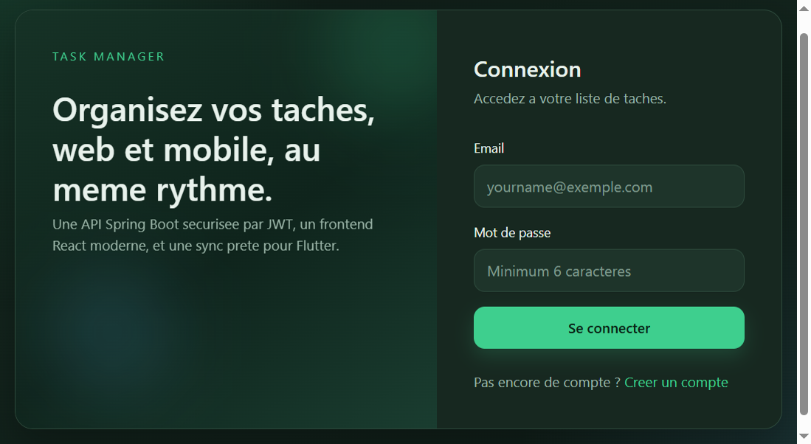
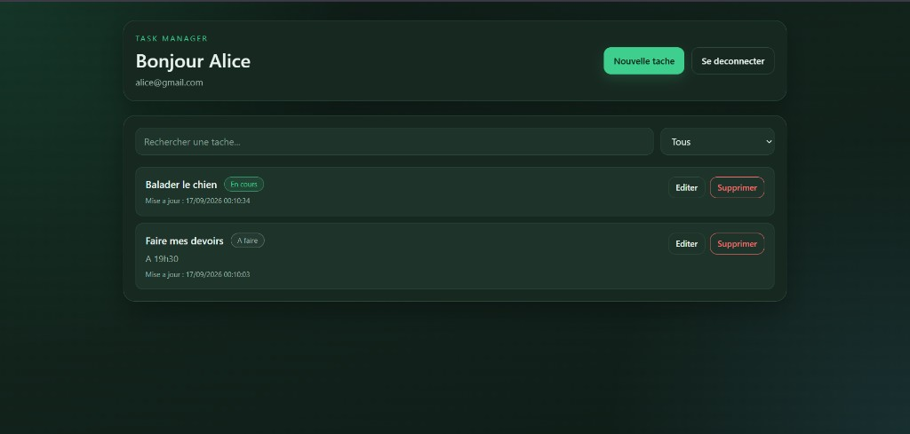
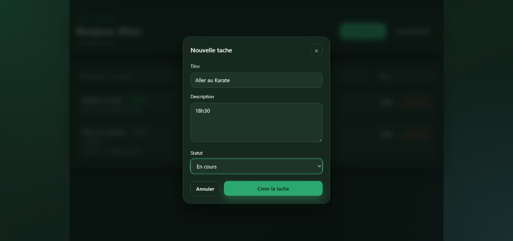

# Task Manager

Mini application de gestion de taches realisee pour le test de recrutement.

## Stack

- Backend: Java 17, Spring Boot 3.3, Spring Security JWT, Spring Data JPA
- Base de donnees: H2 (profil `dev`) ou MySQL (profil `mysql`)
- Frontend: React, Vite, TypeScript, Tailwind CSS
- Conteneurisation: Docker, docker-compose
- CI: GitHub Actions

## Architecture

```text
frontend (React)  --->  /api/*  --->  backend (Spring Boot)  --->  MySQL / H2
mobile (Flutter bonus)  ---------|
```

Le token JWT est stocke cote web dans `localStorage` et envoye via `Authorization: Bearer`.

## Structure du depot

```text
backend/     API REST Spring Boot
frontend/    Application web React
mobile/      Application Flutter (bonus)
docker-compose.yml
```

## Demarrage local (sans Docker)

### Backend

Prerequis: Java 17+.

```bash
cd backend
./mvnw spring-boot:run
```

Sous Windows:

```bash
cd backend
mvnw.cmd spring-boot:run
```

L API demarre sur `http://localhost:8080` avec le profil `dev` (H2 en memoire).

Pour MySQL local:

```bash
set SPRING_PROFILES_ACTIVE=mysql
mvnw.cmd spring-boot:run
```

Variables utiles:

- `MYSQL_HOST`, `MYSQL_PORT`, `MYSQL_DATABASE`, `MYSQL_USER`, `MYSQL_PASSWORD`
- `JWT_SECRET`, `JWT_EXPIRATION_MS`

### Frontend

Prerequis: Node.js 20+.

```bash
cd frontend
npm install
npm run dev
```

Ouvrir `http://localhost:5173`. Le proxy Vite redirige `/api` vers le backend.

## Endpoints API

- `POST /api/auth/register` inscription
- `POST /api/auth/login` connexion JWT
- `GET /api/tasks` liste (filtres `status`, `search`)
- `POST /api/tasks` creation
- `PUT /api/tasks/{id}` modification
- `DELETE /api/tasks/{id}` suppression

Exemple d inscription:

```json
{
  "email": "yourname@exemple.com",
  "password": "secret123",
  "fullName": "votre nom"
}
```

Exemple de tache:

```json
{
  "title": "Preparer la demo",
  "description": "Slides et API",
  "status": "TODO"
}
```

Statuts possibles: `TODO`, `IN_PROGRESS`, `DONE`.

## Captures d'ecran







## Docker Compose

Prerequis: Docker Desktop.

```bash
docker compose build
docker compose up
```

Services:

- Frontend: `http://localhost:3000`
- Backend: `http://localhost:8080`
- MySQL: port `3306`

## Mobile Flutter (bonus)

Voir le dossier `mobile/` pour une application Flutter qui consomme la meme API JWT.

## CI/CD

Le workflow GitHub Actions construit le backend et le frontend a chaque push/PR.

Pour un deploiement GCP Cloud Run (bonus):

1. Builder et pousser les images Docker vers Artifact Registry
2. Deployer le service backend puis le service frontend avec Cloud Run
3. Pointer le frontend vers l URL publique de l API

## Choix techniques

- JWT stateless pour securiser les routes `/api/tasks`
- Isolation des taches par utilisateur proprietaire
- Filtrage serveur (statut + recherche titre/description)
- H2 pour demarrer vite sans installer MySQL
- Nginx reverse proxy en prod pour unifier frontend et API

## Auteur

Pougom Dominique
