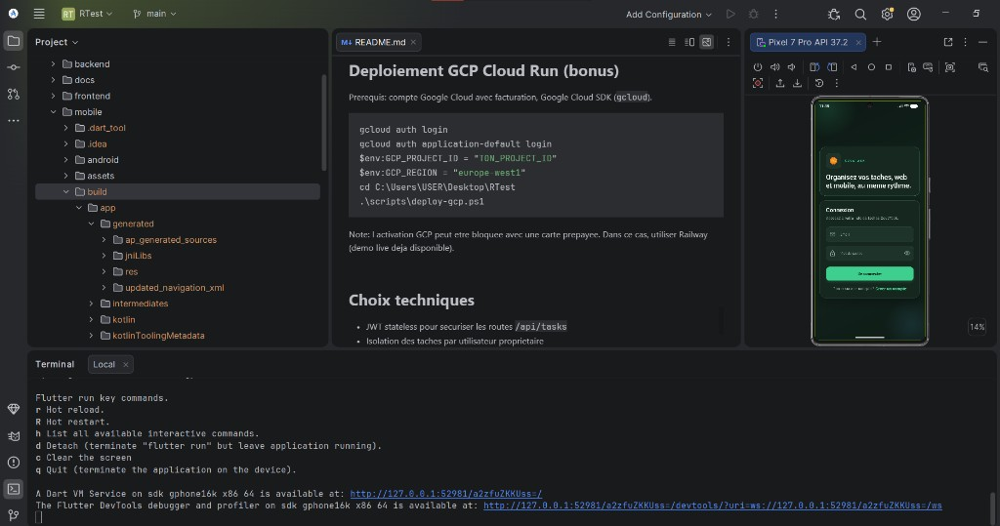
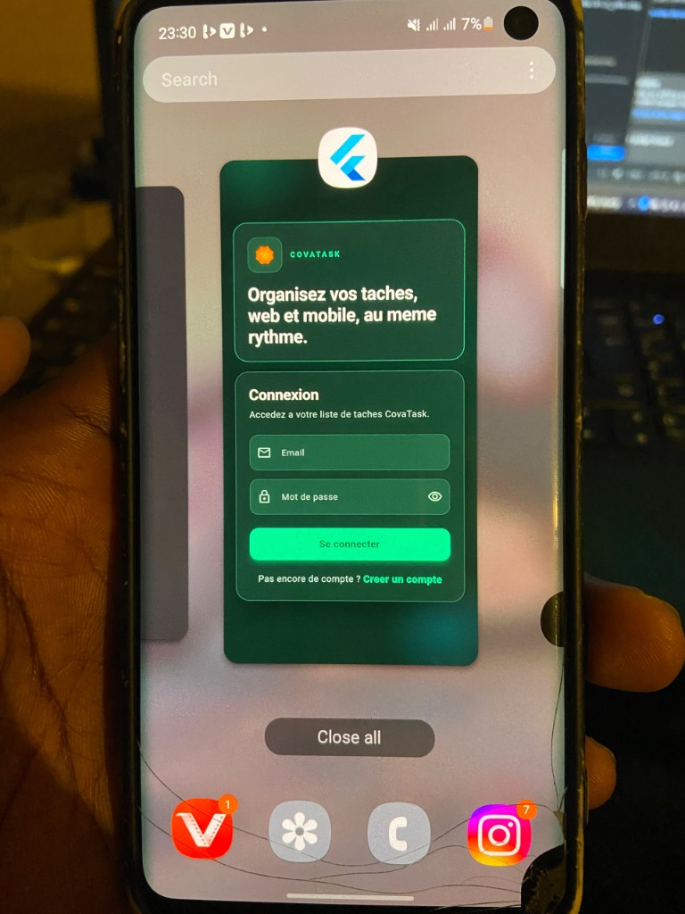

# CovaTask

Application de gestion de taches realisee pour le test de recrutement Cova Africa.

## Demo live

- Web: https://covatask.up.railway.app/login
- API: https://covatest-production.up.railway.app
- Health: https://covatest-production.up.railway.app/api/health

Repo: https://github.com/DominiqueOthniel/CovaTest

## Stack

- Backend: Java 17, Spring Boot 3.3, Spring Security JWT, Spring Data JPA
- Base de donnees: H2 (profil `dev`) ou MySQL (profil `mysql`)
- Frontend: React, Vite, TypeScript, Tailwind CSS
- Mobile (bonus): Flutter (meme API JWT)
- Conteneurisation: Docker, docker-compose
- CI: GitHub Actions
- Deploiement: Railway (alternative a GCP Cloud Run)

## Architecture

```text
frontend (React)  --->  /api/*  --->  backend (Spring Boot)  --->  MySQL / H2
mobile (Flutter bonus)  ---------|
```

Le token JWT est stocke cote web dans `localStorage` et envoye via `Authorization: Bearer`.
Web et mobile consomment la meme API, donc les donnees sont synchronisees.

## Structure du depot

```text
backend/     API REST Spring Boot
frontend/    Application web React
mobile/      Application Flutter (bonus)
docker-compose.yml
docs/        Guides Railway et captures
```

## Demarrage local (sans Docker)

### Backend

Prerequis: Java 17+.

```bash
cd backend
./mvnw spring-boot:run
```

Sous Windows:

```bash
cd backend
mvnw.cmd spring-boot:run
```

L API demarre sur `http://localhost:8080` avec le profil `dev` (H2 en memoire).

Pour MySQL local:

```bash
set SPRING_PROFILES_ACTIVE=mysql
mvnw.cmd spring-boot:run
```

Variables utiles:

- `MYSQL_HOST`, `MYSQL_PORT`, `MYSQL_DATABASE`, `MYSQL_USER`, `MYSQL_PASSWORD`
- `JWT_SECRET`, `JWT_EXPIRATION_MS`

### Frontend

Prerequis: Node.js 20+.

```bash
cd frontend
npm install
npm run dev
```

Ouvrir `http://localhost:5173`. Le proxy Vite redirige `/api` vers le backend.

## Endpoints API

- `POST /api/auth/register` inscription
- `POST /api/auth/login` connexion JWT
- `GET /api/tasks` liste (filtres `status`, `search`)
- `POST /api/tasks` creation
- `PUT /api/tasks/{id}` modification
- `DELETE /api/tasks/{id}` suppression
- `GET /api/health` sante

Exemple d inscription:

```json
{
  "email": "yourname@exemple.com",
  "password": "secret123",
  "fullName": "votre nom"
}
```

Exemple de tache:

```json
{
  "title": "Preparer la demo",
  "description": "Slides et API",
  "status": "TODO"
}
```

Statuts possibles: `TODO`, `IN_PROGRESS`, `DONE`.

## Captures d'ecran

### Web


### Mobile Flutter





## Docker Compose

Prerequis: Docker Desktop.

```bash
docker compose build
docker compose up
```

Services:

- Frontend: `http://localhost:3000`
- Backend: `http://localhost:8080`
- MySQL: port `3306`

## Mobile Flutter (bonus)

Application Flutter dans `mobile/` qui consomme la meme API JWT que le web
(sync des taches sur le meme backend Railway).

Testee sur emulateur Android (Pixel) et telephone Android. APK release generable via
`flutter build apk --release`.

```bash
cd mobile
flutter pub get
flutter run
```

## Tests

Backend (MockMvc, auth + CRUD taches + isolation utilisateur):

```bash
cd backend
./mvnw test
```

Frontend (client API avec Vitest):

```bash
cd frontend
npm test
```

## CI/CD

Le workflow GitHub Actions execute les tests puis construit le backend et le frontend a chaque push/PR.

## Deploiement live (Railway)

Guide detaille: [docs/RAILWAY.md](docs/RAILWAY.md)

- Web: https://covatask.up.railway.app
- API: https://covatest-production.up.railway.app
- Health: https://covatest-production.up.railway.app/api/health
- Frontend build: `VITE_API_URL` pointe vers l API
- MySQL: profil `mysql` (Docker Compose local ou base Railway)

## Deploiement cloud (bonus)

Le sujet proposait un lien deploye via **Cloud Run** ou **Firebase Hosting**.

### Pourquoi pas Firebase Hosting

Firebase Hosting est pense pour servir un frontend (et l ecosysteme Firebase).
Ce projet repose sur une **API Spring Boot + MySQL + JWT**. Heberger seulement le
front sur Firebase aurait laisse le backend hors du deploiement, donc hors sujet
pour une demo full stack complete.

### Pourquoi pas Cloud Run (GCP) en live

Cloud Run etait le choix le plus aligne (containers Docker).
Dockerfiles + script `scripts/deploy-gcp.ps1` sont prets.
L activation Google Cloud a ete bloquee (carte prepayee refusee).

### Pourquoi Railway

Railway permet de deployer le meme besoin technique :
frontend React + API Spring Boot + MySQL + URL publique.
Demo live : https://covatask.up.railway.app/login

Pour reessayer GCP plus tard (carte bancaire classique) :

```powershell
gcloud auth login
gcloud auth application-default login
$env:GCP_PROJECT_ID = "TON_PROJECT_ID"
$env:GCP_REGION = "europe-west1"
cd C:\Users\USER\Desktop\RTest
.\scripts\deploy-gcp.ps1
```

## Choix techniques

- JWT stateless pour securiser les routes `/api/tasks`
- Isolation des taches par utilisateur proprietaire
- Filtrage serveur (statut + recherche titre/description)
- H2 pour demarrer vite sans installer MySQL
- Firebase Hosting ecarte car inadapte au stack Spring Boot + MySQL
- Cloud Run anticipe (Docker + script GCP), bloque par moyen de paiement
- Railway choisi pour livrer une demo publique complete

## Auteur

Pougom Dominique
